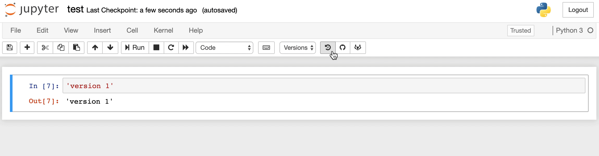

# Jupyter notebook tool 

## Installation
`pip intall jupytertoolbox`

> #### Important
> Jupyter notebook server might need to be restarted for server etension to work. If after saving a version, the page didn't refresh & new version didn't show up in Verions dropdown menu. Then: 
>    - in local machine, close the jupyter notebook terminal or ctrl-c, and restart another one
>    - in cloud instance, reboot instance

## Features

1. Version control
    - multiple storage options:
        - save locally
        - save to github (coming soon)
        - save to gitlab (coming soon)
    - show historical versions in dropdown menu
    - switch to specific version of the notebook with a click

2. Automatically experiment tracking
    - most of useful parameters, loss, metrics, data version, model pointer etc....
    - upload to multiple tracking service:
        - neptune (developing)
        - model chimp (maybe)
        - ml flow (maybe)

